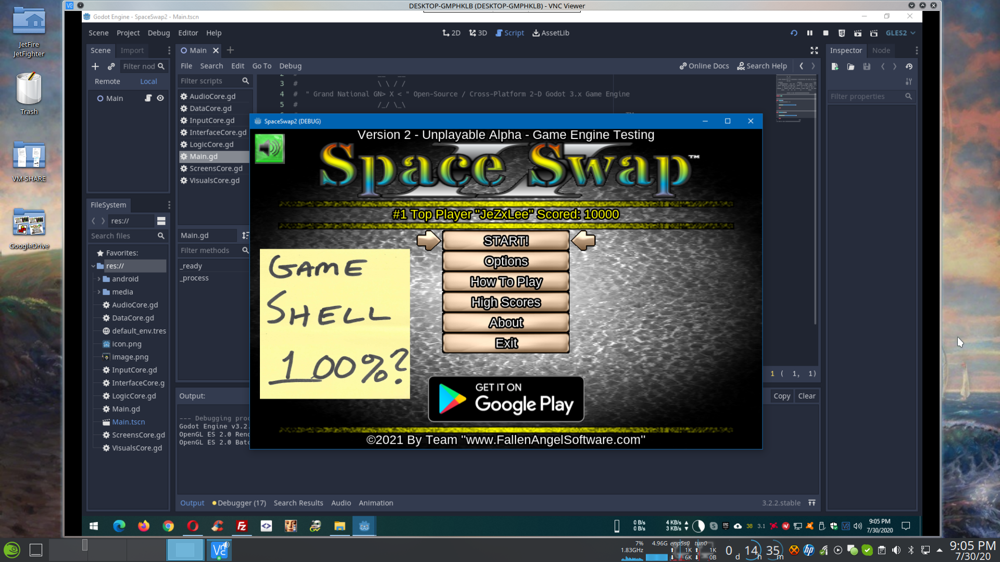

# Godot-SpaceSwap2
100% FREE Cross-Platform Open-Source Godot Video Game!  

Game engine code name: "Grand National GNX"  

STATUS OF GAME ENGINE CORES:  
- 100% - AudioCore  
-  85% - DataCore  
-  75% - InputCore  
-  50% - InterfaceCore  
-   5% - LogicCore  
-  75% - ScreensCore  
-  90% - VisualsCore  
 
 
Click below to play HTML5 game demo in your Internet browser:  
http://fallenangelsoftware.com/stuff/files/SpaceSwap2/HTML5/index.html
 
 
Click below to visit the official game webpage:  
http://fallenangelsoftware.com/GNX_Engine.html
 
 
Click below to visit the Godot engine website:  
https://godotengine.org
